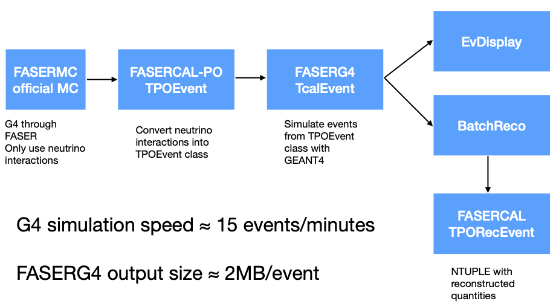

# FASERCAL - electronic calorimeter for FASER Run4

FASERCAL code to simulate and analyse events in the FASERCAL detector

# Event data flow

This project follows a structured workflow for simulating and processing neutrino interactions within the FASERCAL experiment using GEANT4. The process begins with the FASERMC official Monte Carlo (MC) simulation. These interactions are converted into the TPOEvent class format by **ConvertFASERMC**. Next, the **FASERG4** module uses GEANT4 to simulate events from the TPOEvent class, generating TcalEvent objects. These simulated events can be visualized using the **EvDisplay** module or processed through the **BatchReco** module for batch reconstruction, providing a comprehensive analysis pipeline for neutrino interaction events.



# BatchReco (in Batch directory)

Basic code to read FASERCAL GEANT4 output and batch reconstruct events, filling histograms, ...

Usage: ./batchreco.exe <run> [maxevent] [mask]
   <run>                     Run number
   maxevent                  Maximum number of events to process (def=-1)
   mask                      To process only specific events (def=none):   nueCC, numuCC, nutauCC, nuNC or nuES

# EvDisplay

EvDisplay - basic Interactive Event Display of FASERCAL GEANT4 output

Usage: ./evDisplay.exe <run> [mask]
   <run>                     Run number
   mask                      To process only specific events (def=none):   nueCC, numuCC, nutauCC, or nuNC

- run the event display

   to display nueCC events
   ```bash
   $ ./evDisplay.exe 200026 nueCC
   ````

   to display numuCC events
   ```bash
   $ ./evDisplay.exe 200025 numuCC
   ````

   to display nutauCC events
   ```bash
   $ ./evDisplay.exe 200035 nutauCC
   ````


# DumpHits (in BatchReco directory)

Very simple app to read and dump all hits from events

Usage: ./dumphits.exe <run> [maxevent] [mask]
   <run>                     Run number
   maxevent                  Maximum number of events to process (def=-1)
   mask                      To process only specific events (def=none):   nueCC, numuCC, nutauCC, nuNC or nuES

for example to get all the hits of nueCC events from the kaon decay flux:

   ```bash
   $ ./dumphits.exe 200026 10 nueCC > dump.log
   ```

# FASERTuple

Convert official FASER MC files into FASERCAL PO files (generator level) 

# TauSearch
A generator level tau search analysis code

- t.C : code to convert FASER ntuple into event summary tuples
- s.C : analyse event summary tuples for each tau decay channel and create sig/background tuples
- a.C : read sig/bkg tuples for each decay channel and perform BDT analysis

# Installation preliminaries

- Get the source code:

   ```bash
   $ git clone https://github.com/rubbiaa/FASER.git
   ````

- Set up ROOT and GEANT4 environment in the setup.sh file:

setup.sh:
    source <ROOTINSTAL>/bin/thisroot.sh
    source <GEANT4INSTALL>/bin/geant4.sh

$ source setup.sh

- On lxplus use the following command instead:

   ```bash
   $ source lxplus_setup.csh
   ````

# Install event display

 - move to the evDisplay directory and compile with "make"

   ```bash
   $ cd evDiplay
   $ make
   ````

 - if compilation and linking was successful, the executable is "evDisplay.eve"

 - make sure G4 FASERCAL simulated files are linked at the "input" subdirectory
 
   ```bash
   $ ln -fs </path_to_g4_simulated_data> input
   ````

 - on lxplus.cern.ch, there is data available

   ```bash
    $ ln -fs /eos/home-r/rubbiaa/FASERCALDATA_v2.0 input
   ````

   For this to work, you need to be able to access my CERNBOX - please send me an email and I will give you access.

 # Event masks

 - event masks are used to select only a type of events when running a job

 - the currently available event masks are:

   nueCC - nue charged currents
 
   numuCC  - numu charged currents
 
   nutauCC - nutau charged currents
 
   nuNC - all neutrinos neutral currents
 
   nuES - elastic scattering off target electrons 


# Run numbers

 - run numbers are taken from the official FASER conventions

    200025 flux from pion decay (i.e. basically numu)
 
    200026 flux from kaon decay (i.e. mainly numu and nue)
 
    200035 flux from charm decay (i.e. numu, nue and some nutau)

# Instructions for Reading ROOT Files using PyROOT

Please check the directory `Python_io`

